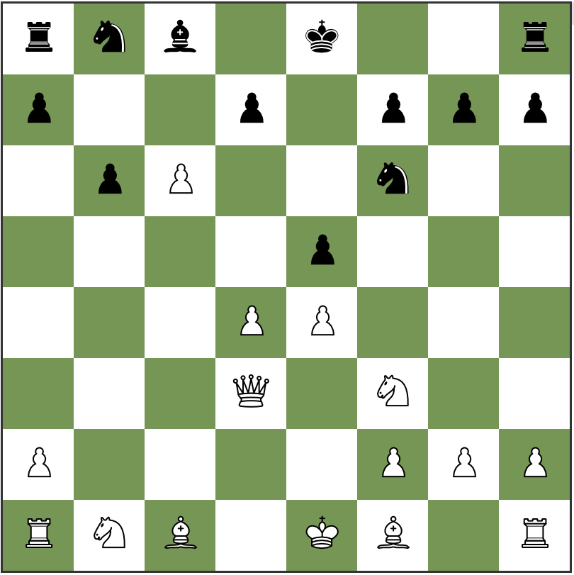

# Chess

## Overview

This project contains a web application for playing chess. Press the "New Game" button to get started!

## How to Run

* Download the [Dotnet SDK](https://dotnet.microsoft.com/download) and [npm](https://www.npmjs.com/get-npm).

* Open the solution in Visual Studio or folder Visual Studio Code.

* Run `npm install` in Chess.Web

* Start the Chess.Web project by selecting and running the project in Visual Studio, or by hitting F5 in Visual Studio Code.

* After compiling it should launch a browser and go to localhost:5001

## How to Play

* On the page, click "New Game"

* For each turn, click the piece and then click the desired square for the piece to land.
